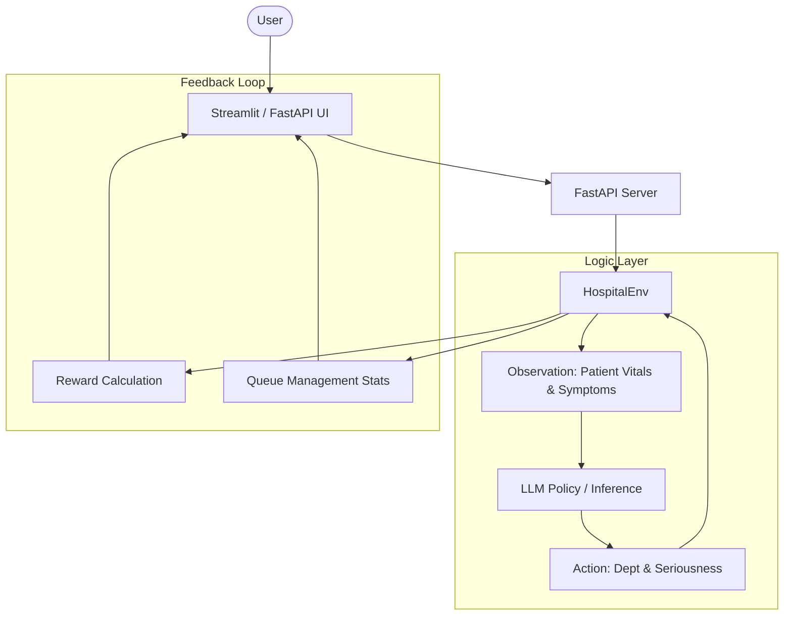

# Smart Hospital: RL Management Dashboard

🏥 Smart Hospital: Adaptive Triage & Resource Optimization Environment

Smart Hospital is a real-world reinforcement learning environment designed to simulate hospital triage and resource allocation under uncertainty.

Unlike traditional rule-based systems, this environment challenges AI agents to make high-stakes decisions where incorrect prioritization can lead to severe penalties—mirroring real clinical trade-offs.

---

### 🚨 Problem

Modern hospitals face:

- Overcrowded emergency departments
- Limited staff and critical care resources
- High variability in patient severity
- Risk of under-triaging critical patients or overloading specialists

Current systems rely heavily on static triage protocols, which struggle under dynamic and uncertain conditions.

---

## 🏗️ System Architecture

Our system follows a modular architecture where an RL environment interacts with an AI-driven policy, visualized through multiple dashboard layers.



---

## ⚙️ Environment Design

###  Observation Space
The observation space is a dictionary containing normalized patient data:
- **`symptoms`**: List of strings (e.g., `["chest pain", "shortness of breath"]`)
- **`age`**: Patient age (normalized 0.0 - 1.0)
- **`heart_rate`**: BPM (normalized 0.0 - 1.0)
- **`blood_pressure`**: Systolic BP (normalized 0.0 - 1.0)
- **`risk`**: Dictionary of binary indicators (`high_heart_rate`, `low_blood_pressure`, `elderly`)
- **`progress`**: Completion percentage of the current task (0.0 - 1.0)

###  Action Space
The agent must provide a dictionary containing:
- **`department`**: One of `["cardiology", "neurology", "orthopedics", "pulmonology", "general", "emergency"]`
- **`seriousness`**: Integer scale from `1` (mild) to `5` (critical)

###  Reward System
- **Base Reward**: Graded score based on True Seriousness vs. Predicted Seriousness.
- **Department Bonus**: `+2.0` for correct specialty assignment.
- **Safety Penalty**: `-2.0` if a critical patient (Seriousness 4+) is assigned low priority (2 or less).
- **Efficiency Bonus**: `+0.5` for maintaining correct queue priority.

---

## 📊 Tasks

| Task   | difficulty | Description                                      |
|--------|------------|--------------------------------------------------|
| Easy   | easy       | Department prediction only                       |
| Medium | medium     | Unified Department + Seriousness prediction      |
| Hard   | hard       | Full triage with extreme risk-aware penalties    |

---

## 🚦 How to Run

### 1. Install Dependencies
Ensure you have Python 3.9+ installed, then run:
```bash
python3 -m pip install -r requirements.txt
```

### 2. Launch the Development Server (FastAPI)
The backend server handles the RL environment and LLM bridge:
```bash
python3 server/app.py
```
Accessibility: `http://localhost:7860`

### 3. Launch the Streamlit Dashboard (Alternative)
For a heavy diagnostic visualization:
```bash
streamlit run streamlit_app.py
```

### 4. Run CLI Baseline
To test the inference logic directly via terminal:
```bash
python3 inference.py
```

---

## 🏗️ Project Structure

- `env/`:
  - `hospital_env.py`: Core Gymnasium-like environment logic.
  - `models.py`: Pydantic schemas for Patients and Actions.
  - `generator.py`: Synthetic patient data generated based on medical priors.
- `server/`:
  - `app.py`: FastAPI implementation of the web dashboard.
- `inference.py`: Hybrid AI policy (LLM + Rule-based fallback).
- `openenv.yaml`: Standard environment specification metadata.

---

## 🌍 Real-World Impact

This system is designed as a **decision-support layer**, not a replacement for clinicians. It helps in:
- Emergency department triage simulations
- Hospital load balancing under demand spikes
- Stress-testing AI robustness in high-stakes clinical settings

---

## Hugging-Face Link 
[Hospital Triage OpenEnv on HF](https://huggingface.co/spaces/abhinavvsingh/vaats)

## UI Preview


---
Built with ❤️ for AI research and healthcare efficiency.